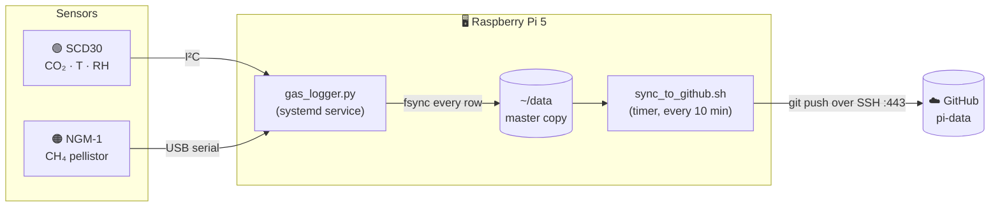
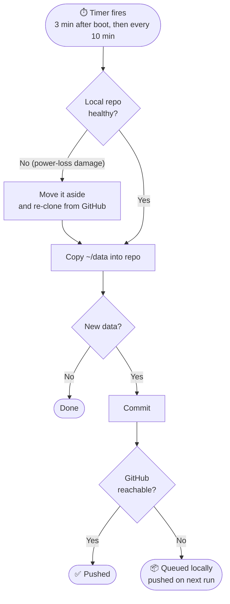

<div align="center">

# 🐄 pi-data

**Continuous CO₂ and CH₄ logging for headbox indirect calorimetry**

Raspberry Pi 5 · Sensirion SCD30 (NDIR CO₂) · NGM-1 pellistor (CH₄)


[Overview](#-overview) · [Pipeline](#-how-it-works) · [Data layout](#-data-layout) · [File formats](#-file-formats) · [Quick start](#-quick-start-python) · [Hardware](#-hardware)

</div>

---

## 📡 Overview

This repository holds raw data from a dual-gas logger built for headbox indirect calorimetry validation at the University of Nebraska-Lincoln. The Pi pushes new data here on its own.

> [!IMPORTANT]
> **Do not edit anything under `data/` by hand.** The Pi's local copy is the master record and overwrites this folder on every sync.

> [!TIP]
> Always take timing from the **timestamp columns**, never from the row number. Each sensor's own clock sets its sample rate, and neither one runs at exactly its nominal period.

| | Sensor | Measures | Interface | Actual period |
|:-:|---|---|---|---|
| 🟢 | **Sensirion SCD30** | CO₂ (NDIR), temperature, RH | I²C `0x61` @ 50 kHz | **~2.13 s** (set to 2 s) |
| 🟠 | **NGM-1** | CH₄ (catalytic bead) | USB CDC serial | **~21.0 s** (nominal 20 s) |
| 🖥️ | **Raspberry Pi 5** | Host, health monitoring | | health snapshot every 60 s |

---

## ⚙️ How it works



<details>
<summary><b>🔁 What happens when things go wrong</b> (click to expand)</summary>
<br/>



| Failure | What the system does |
|---|---|
| 💥 Logger crashes | systemd restarts it within 5 s and opens a new `run_` folder |
| 🔌 Power loss | The CSVs survive up to the last row, and the logger restarts on boot |
| 📶 No WiFi | Logging carries on; commits queue and push when the connection returns |
| 🧩 Git repo corrupted | Detected on the next sync, re-cloned from GitHub, then all data is re-copied |
| 🔄 USB sensor drops out | The serial port is reopened automatically and a reconnect is logged |
| ⚠️ Repeated I²C errors | The SCD30 is re-initialised after 5 consecutive errors |
| 🕐 Clock jumps | Detected against the monotonic clock and written to `events.csv` |

</details>

> [!NOTE]
> GitHub lags the Pi by **at most about 10 minutes** while it's online.

---

## 📁 Data layout

```
data/
└── run_YYYYmmdd_HHMMSS/        ← one folder per logger start
    ├── scd30.csv               🟢 CO₂ / T / RH, one row per sample
    ├── ngm1.csv                🟠 CH₄, one row per sensor line
    ├── health.csv              🖥️ Pi health, every 60 s
    └── events.csv              📋 starts, errors, reconnects, clock steps
```

Every start (a boot, a crash restart or a manual restart) creates a new `run_` folder, so gaps show up in the folder list instead of being silently joined together.

> [!WARNING]
> Folder names come from the Pi's clock **at the moment the logger started**. If the Pi boots without network or an RTC battery, that clock can be wrong. Treat the `events.csv` start line and the `monotonic_s` column as the true record.

---

## 📊 File formats

Every file shares three time columns, all captured at the same instant:

| Column | Meaning |
|---|---|
| `timestamp_iso` | Local time with UTC offset, ms resolution, e.g. `2026-09-26T17:00:44.177-05:00` |
| `unix_s` | The same instant as Unix time (s) |
| `monotonic_s` | Seconds since boot. **Never jumps**, so it's the reference for repairing clock steps |

<details>
<summary><b>🟢 <code>scd30.csv</code></b>: CO₂, temperature, humidity</summary>
<br/>

| Column | Unit | Notes |
|---|---|---|
| `seq` | | Per-run sequence number, starting at 1 |
| `co2_ppm` | ppm | CO₂ concentration |
| `temp_c` | °C | Reads above ambient because of sensor self-heating and nearby Pi heat |
| `rh_pct` | % | Relative to the sensor's own (warm) temperature |
| `qc_flag` | | `range` if a value is outside physical limits, otherwise empty |

- ASC (automatic self-calibration) is **forced OFF** at every start.
- The first sample after each start is dropped as a stale buffer value.

</details>

<details>
<summary><b>🟠 <code>ngm1.csv</code></b>: methane pellistor</summary>
<br/>

| Column | Unit | Notes |
|---|---|---|
| `seq` | | Per-run sequence number |
| `adc_code` | counts | ⭐ **Analytical variable.** Sits near −700 in clean air and moves toward 0 as CH₄ rises |
| `uo_mv` | mV | Bridge output voltage |
| `module_temp_c` | °C | Module temperature |
| `status` | | `0` = normal |
| `module_c_pct_unused` | % | The module's own estimate. **Inverted, not used** |
| `parsed` | 0/1 | `1` = the line matched the expected format |
| `dup` | 0/1 | `1` = a repeat of the previous line within 15 s (test-button reprint) |
| `raw_line` | | The exact text from the module, always kept |

> Filter to `parsed == 1 and dup == 0`. One partial, unparsed line at the start of each run is normal.

</details>

<details>
<summary><b>🖥️ <code>health.csv</code></b>: Pi health every 60 s</summary>
<br/>

| Column | Meaning | ✅ Healthy |
|---|---|---|
| `cpu_temp_c` | SoC die temperature (**not** air temperature) | Levels off below ~70 °C |
| `throttled` | Firmware power and thermal flags | `0x0` |
| `disk_free_mb` | Free storage | Stable |
| `ntp_synced` | Clock synced to network time | `yes` while online |
| `wall_minus_mono_s` | Wall clock minus monotonic clock | Constant |
| `clock_step_s` | Filled in only when the wall clock jumps by more than 0.5 s | Empty |
| `scd_ok` / `scd_err` / `scd_reinits` | Cumulative SCD30 counts | Rising by ~28/min, errors 0 |
| `ngm_ok` / `ngm_unparsed` / `ngm_reconnects` | Cumulative NGM-1 counts | Rising by ~3/min, reconnects 0 |

**Decoding `throttled`** (bits set "now" / "since boot"):

| Now | Since boot | Meaning |
|:-:|:-:|---|
| `0x1` | `0x10000` | ⚡ Undervoltage |
| `0x2` | `0x20000` | Frequency capped |
| `0x4` | `0x40000` | Throttled |
| `0x8` | `0x80000` | 🌡️ Soft temperature limit |

</details>

<details>
<summary><b>📋 <code>events.csv</code></b>: run log</summary>
<br/>

| Column | Values |
|---|---|
| `level` | `INFO` · `WARN` · `ERROR` |
| `source` | `main` · `scd30` · `ngm1` · `clock` · `health` |
| `message` | Start arguments, sensor settings at init, errors, reconnects, clock steps |

</details>

---

## 🐍 Quick start (Python)

```python
import pandas as pd
from pathlib import Path

run = Path("data/run_20260926_170642")          # pick any run folder

scd = pd.read_csv(run / "scd30.csv", parse_dates=["timestamp_iso"])
ngm = pd.read_csv(run / "ngm1.csv",  parse_dates=["timestamp_iso"])
ngm = ngm[(ngm.parsed == 1) & (ngm.dup == 0)]

# 1-minute averages on the time axis (never on row count)
co2 = scd.set_index("timestamp_iso")["co2_ppm"].resample("1min").mean()
ch4 = ngm.set_index("timestamp_iso")["adc_code"].resample("1min").mean()

print(f"SCD30 period: {scd.unix_s.diff().median():.2f} s")
print(f"NGM-1 period: {ngm.unix_s.diff().median():.2f} s")
```

<details>
<summary><b>🕐 Repairing a clock step</b></summary>
<br/>

If `events.csv` contains `wall clock stepped +X s relative to monotonic`, the rows written **before** that event are `X` seconds off. Fix them using the monotonic column:

```python
step_s       = 89.082    # X, from the events.csv message
step_at_mono = 65.127    # monotonic_s of that event row

before = scd.monotonic_s < step_at_mono
scd.loc[before, "unix_s"] += step_s
scd["timestamp_fixed"] = pd.to_datetime(scd.unix_s, unit="s", utc=True).dt.tz_convert("America/Chicago")
```

</details>

<details>
<summary><b>📥 Download everything</b></summary>
<br/>

```bash
git clone git@github.com:Ishrat2110/pi-data.git
cd pi-data && git pull     # later, to get the newest data
```

</details>

---

## 🔧 Hardware

<details>
<summary><b>🔌 SCD30 → Raspberry Pi 5 wiring</b></summary>
<br/>

```
        Pi 5 GPIO header (top-left, USB ports facing down)
        ┌─────────┬─────────┐
 3.3V ● │  1   2  │ ○  5V       SCD30 VDD  → pin 1
 SDA  ● │  3   4  │ ○  5V       SCD30 SDA  → pin 3
 SCL  ● │  5   6  │ ●  GND      SCD30 SCL  → pin 5
        │  7   8  │             SCD30 GND  → pin 6
        └─────────┴─────────┘   SEL, RDY, PWM: not connected
```

| SCD30 | Pi 5 pin |
|---|---|
| VDD | 1 (3.3 V) |
| SDA | 3 (GPIO2) |
| SCL | 5 (GPIO3) |
| GND | 6 |

`/boot/firmware/config.txt` sets `dtparam=i2c_arm_baudrate=50000` for SCD30 clock stretching.

</details>

<details>
<summary><b>🧰 Software stack</b></summary>
<br/>

| Piece | Role |
|---|---|
| `gas_logger.py` | Reads both sensors in separate threads, fsyncs every row, logs health and events |
| `gaslogger.service` | Starts the logger at boot (no network needed) and restarts it on a crash |
| `sync_to_github.sh` | Copies data into the repo, commits, pushes, and repairs a corrupted repo |
| `gasdata-sync.timer` | Runs the sync 3 min after boot, then every 10 min |
| Deploy key + SSH on port 443 | Write access to this repo only; works on networks that block port 22 |

</details>

---

<div align="center">

**Maintainer:** Ishrat Jandu · Biological Systems Engineering · University of Nebraska-Lincoln

</div>
